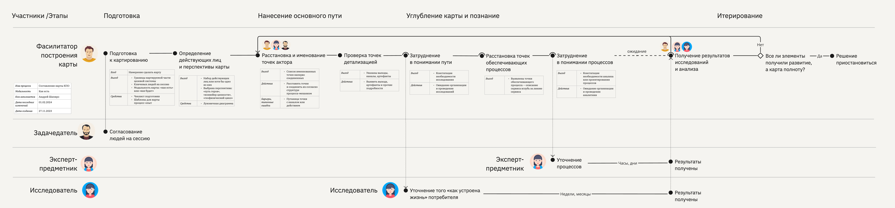

# База знаний метода «Карта процесса-опыта»

Карта процесса-опыта — метод визуализации любого хозяйственного процесса с бо́льшим акцентом на человеке при одновременном учёте технической стороны вопроса. Эта схема согласует пользовательский опыт и обеспечивающие его бизнес-процессы.

## Содержание

- [Вводная статья](https://ashapiro.ru/articles/xpm) о карте процесса-опыта
- [Примеры карт](#examples)
- [Назначение](#purpose)
- [Элементы карты](#elements)
- [Типичные конфигурации](#configurations)
- [Шаблоны](#templates)
- [Историческая справка](history.md)
- [Глоссарий](glossary.md)
- [Материалы](#materials)
- [Обратная связь и кооперация](#feedback)

## Примеры карт процесса-опыта 

1. [Сервис покупки рекламы на цифровых экранах](xpm-examples/01-xpm-example-advert.pdf)
2. [Услуга печати в копи-центре](xpm-examples/02-xpm-example-printout.pdf)
3. [Опыт покупки автозапчастей](xpm-examples/03-xpm-example-spareparts.pdf)
4. [Процесс составления карты процесса-опыта](xpm-examples/04-xpm-example-xpm-xpm.pdf)
5. [Обобщенная услуга](xpm-examples/05-xpm-example-common-service.pdf)

## Назначение метода 

Метод призван выявлять схему соорганизации процессов внутри какой-то деятельности, как в мега-машине по производству потребительской ценности, а также согласовывать эти процессы с жизнедеятельностью потребителей. Метод хорош для того, чтобы

- в общих чертах или углублённо схватить механику процессов в деятельности,
- добиться согласованности во внутренних процессах,
- и пристально рассмотреть места стыков механизмов системы с живыми участниками, будь они потребители или её служащие.

За границами применимости метода описание так называемых ad-hoc-процессов или ситуативного управления, когда выверенного процесса-механизма нет, а действия и взаимодействия могут идти в произвольном порядке со спонтанным выбором средств в каждой ситуации

## Преимущества

- Лаконичная, наглядная схема процесса
- Минимум элементов нотации — быстро освоить
- Высокая скорость ведения сессий сбора требований о процессе
- Гибкость в выборе масштаба схемы за счёт понятия ключевой точки
- Детально рассматривает места взаимодействий людей и сервисов
- Поддержка нелинейного пользовательского пути при сохранении аннотирования ключевых точек информационными элементами: вход/выход, канал—артефакт, барьер—средство.

## Элементы карты 

- **Акторы 👩 и агенты 👱🏻‍♂️🤖** — действующие лица, имеющие намерения и свободу действий или те, кто обслуживает процесс, включая машинные сервисы.
- **Ключевые точки ●** — наиважнейшие места, где происходит одно из трёх: принятие решения, взаимодействие, преобразование.
- **Линии тока** — соединительные линии, собирающие ключевые точки в последовательную цепочку процесса
- **Линии взаимодействий** — вертикальные линии, соединяющие ключевые точки разных акторов и агентов в единый процесс-механизм.
- **Триггеры ◇** — элементы ветвления организующией течение логики процесса по разным веткам
- **События ◇** — мгновенные изменения состояний, вехи в процессе, служащие для ориентации в карте или запуска от них линий тока.
- **Аннотационный блок** — блок с описанием важных параметров точки контакта. Минимально содержит описания входа, выхода, канала, артефактов или используемых систем, барьеров и средство их преодоления. Именно в аннотационном блоке происходит начинение подробностями.

Подробнее об элементах карты [см. в статье](https://ashapiro.ru/articles/xpm#elements).

## Обозначения 

| Обозначение | Описание                           |
| :---------- | :--------------------------------- |
| ●           | ключевая точка                     |
| ○           | ключевая точка вне контроля        |
| ◠           | обход ключевой точки               |
| ◇           | триггер или событие                |
| ⎯           | линия тока                         |
| ┈           | линия тока с задержкой или обрывом |
| ⦙           | линия взаимодействия               |

## Алгоритм построения карты

1. Выбрать целевой процесс.
2. Установить модальность: «как есть», «как будет».
3. Установить акторов.
4. Дать положение и названия ключевым точкам ведущего актора.
5. Ввести дорожки и точки обслуживающих агентов, если применимо.
6. Соединить точки ведущего актора и обслуживающих агентов в единое путешествие.
7. Прикрепить к точкам контакта требуемые для анализа данные: вход—выход, барьеры, артефакты, операции, каналы и прочие.

Ниже схема карты процесса-опыта с более подробным алгоритмом. Показано как карта процесса-опыта сама описывает процесс создания произвольной карты процесса-опыта.

## Типичные конфигурации 

Линейный путь с опциональными точками. Вторая точка необязательна, что равносильно возможности перепрыгнуть через неё

\

Безусловное разветвление и схождение

\

Ветвление событиями

\

Ветвление триггером

\

Ветвление таблицей решений

\

Цикл

\

Петля взаимодействия, пинг-понг

\

Многовариантный старт от событий

\

Многовариантный старт через ключевые точки

\

Выравнивание события с точкой

## Шаблон карты процесса-опыта 

- [Miro](https://miro.com/miroverse/experience-process-mapping-xpm-template/)
- [Excalidraw:](https://excalidraw.com/) [файл библиотеки](templates/xpm-library.excalidrawlib), [пример](templates/xpm-example.excalidraw)
- Figma
  - [v.2.0 с автолэйаутом](templates/xpm-template.fig), доработан [Владимиром Аршуковым](https://github.com/Vladaaar)
  - [v1.0](templates/xpm-template.fig), разработан [Константином Полуяновым](https://github.com/poluyanoff)
- Sketch
- OmniGraffle
- Visio

## [Историческая справка, место и назначение метода](history.md)

## [Глоссарий](glossary.md)

## Материалы 

- [Вводная статья](https://ashapiro.ru/articles/xpm) о карте процесса-опыта
- Книга «Карта процесса-опыта. Проектирование услуги через её визуализацию» — готовится к изданию
- Книга «Как проектировать цифровой сервис»

## Обратная связь и кооперация 

Буду рад любому участию по дополнению базы знаний и развитию практики метода. Присылайте свои карты, наблюдения о находках в организации схем, спрашивайте о непонятных моментах и затруднениях.

#### Способы участия:

- [Задать вопрос автору](https://t.me/ashapiro) в Телеграм
- Обсудить в телеграм-канале [«Как проектировать»](https://t.me/how2scheme)
- Прислать пул-реквест в этот репозиторий
- Прислать свой вариант шаблона карты процесса-опыта
