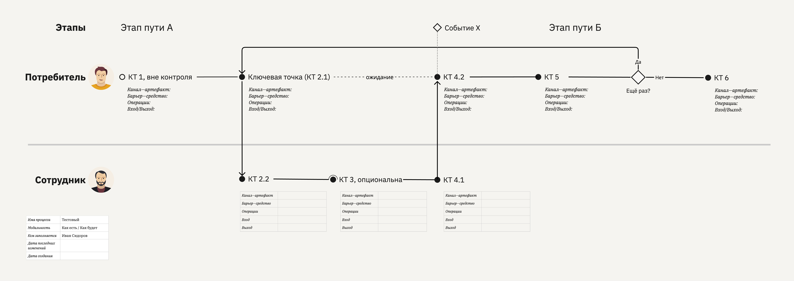
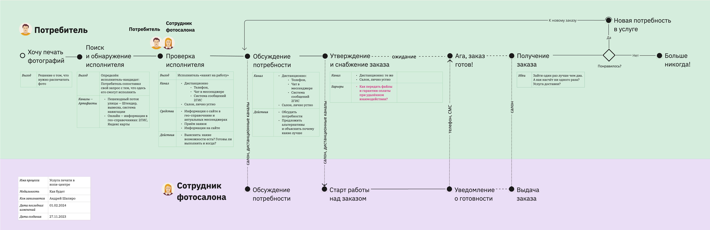
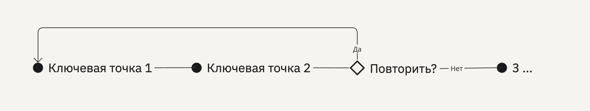
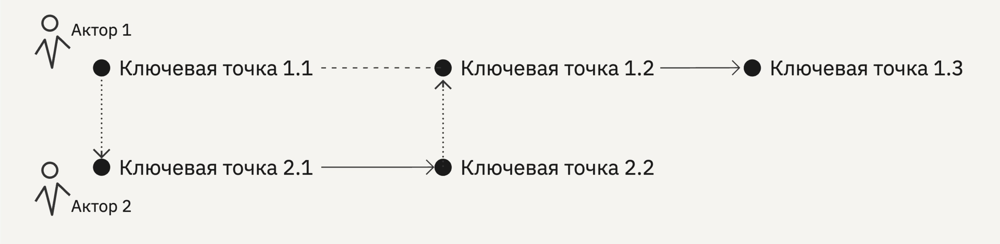

# База знаний метода «Карта процесса-опыта»

Карта процесса-опыта — метод визуализации любого хозяйственного процесса с бо́льшим акцентом на человеке при одновременном учёте технической стороны вопроса. Эта схема согласует пользовательский опыт и обеспечивающие его бизнес-процессы.

## Содержание

- [Вводная статья](https://ashapiro.ru/articles/xpm) о карте процесса-опыта
- [Назначение](#purpose)
- [Элементы карты](#elements)
- [Типичные конфигурации](#configurations)
- [Примеры карт](#examples)
- [Шаблоны](#templates)
<!-- - Книга «Карта процесса-опыта. Проектирование механизма услуги». Готовится к изданию... -->

## Примеры карт процесса-опыта 

1. [Сервис покупки рекламы на цифровых экранах](xpm-examples/01-xpm-example-advert.pdf)
2. [Услуга печати в копи-центре](xpm-examples/02-xpm-example-printout.pdf)
3. [Опыт покупки автозапчастей](xpm-examples/03-xpm-example-spareparts.pdf)
4. [Процесс составления карты процесса-опыта](xpm-examples/04-xpm-example-xpm-xpm.pdf)

## Назначение метода 

Метод призван выявлять схему соорганизации процессов внутри какой-то деятельности, как в мега-машине по производству потребительской ценности, а также согласовывать эти процессы с жизнедеятельностью потребителей. Метод хорош для того, чтобы

- в общих чертах или углублённо схватить механику процессов в деятельности,
- добиться согласованности во внутренних процессах,
- и пристально рассмотреть места стыков механизмов системы с живыми участниками, будь они потребители или её служащие.

\
Главными отличительные чертами метода являются:

- минимум элементов нотации, что снижает порог входа;
- абстракция ключевой точки, что даёт гибкость в управлении содержанием карты, а также дополнительно снижает порог входа;
- лаконичность карты делает её более простым граничным объектом, соединяющим понимание разных группы специалистов в проекте.

За границами применимости метода описание так называемых ad-hoc-процессов или ситуативного управления, когда выверенного процесса-механизма нет, а действия и взаимодействия могут идти в произвольном порядке со спонтанным выбором средств в каждой ситуации

## Элементы карты 

[См. в статье](https://ashapiro.ru/articles/xpm#elements)

## Обозначения 

| Обозначение | Описание                           |
| :---------- | :--------------------------------- |
| ●           | ключевая точка                     |
| ○           | ключевая точка вне контроля        |
| ◠           | обход ключевой точки               |
| ◇           | триггер или событие                |
| ⎯           | линия тока                         |
| ┈           | линия тока с задержкой или обрывом |
| ⦙           | линия взаимодействия               |

## Типичные конфигурации 

Линейный путь с опциональными точками. Вторая точка необязательна, что равносильно возможности перепрыгнуть через неё

\

Безусловное разветвление и схождение

\

Ветвление событиями

\

Ветвление триггером

\

Ветвление таблицей решений

\

Цикл

\

Петля взаимодействия, пинг-понг

\

Многовариантный старт от событий

\

Многовариантный старт через ключевые точки

\

Выравнивание события с точкой

## Шаблон карты процесса-опыта 

- [Miro](https://miro.com/miroverse/experience-process-mapping-xpm-template/)
- [Excalidraw:](https://excalidraw.com/) [файл библиотеки](templates/xpm-library.excalidrawlib), [пример](templates/xpm-example.excalidraw)
- [Figma](templates/xpm-template.fig), разработан [Константином Полуяновым](https://github.com/poluyanoff)
- Sketch
- OmniGraffle
- Visio
