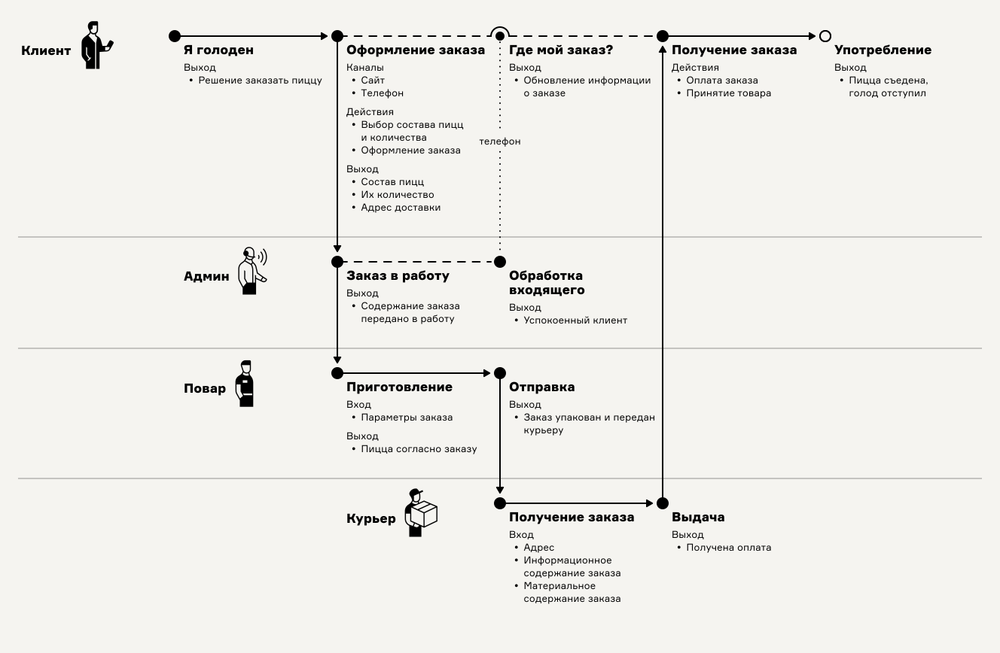
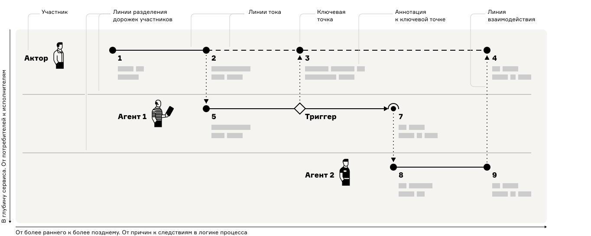
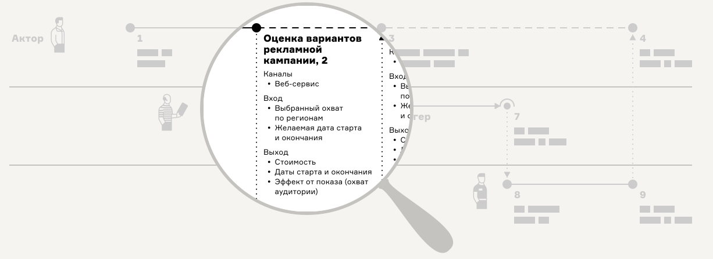
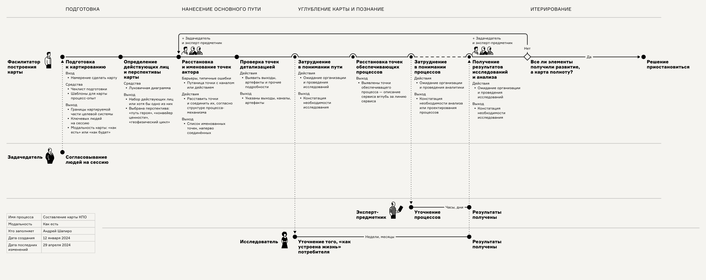

# База знаний метода «Карта процесса-опыта»

Карта процесса-опыта — метод визуализации любого хозяйственного процесса с акцентом на человеке при одновременном учёте технических аспектов. Эта схема согласует пользовательский опыт и обеспечивающие его бизнес-процессы.

## Пресс-релиз

Карты процесса-опыта — новый отечественный метод визуалиализации бизнес-процессов. Главная отличительная черта — баланс между простотой, понятностью и максимальной информативностью. Когда знание о процессе нужно передать самому широкому кругу лиц без подготовки, предлагаемый метод незаменим.

Подход объединяет преимущества и сильные стороны CJM, Service Blueprint и классического «стрелочного» потока работ. Он дополнен возможностью указать каналы, входы-выходы, барьеры и другую важную информацию. Карта междисциплинарна и соединяет в единой схеме представления бизнес-анализа, анализа системных требований, UX- и сервис-дизайна.

Метод наиболее полезен в ситуациях, когда важно

- Сформировать единое понимание процессов во множестве команд и между специалистами разного профиля
- Исследовать или смоделировать взаимосвязанные процессы и опыт взаимодействия множества участников
- Продемонстрировать процесс заинтересованным лицам без аналитической подготовки
- Организовать работу по развитию продукта или услуги системно: на основе структуры процесса-опыта

Практика Карты процесса-опыта выросла и окрепла за 8 лет продуктовой разработки в компании Бындюсофт и входит в связку из трёх обязательных методов в подходе к созданию антихрупкого ИТ-продукта.

## Преимущества

- Наглядность и простота схемы процесса
- Скорость и гибкость при картировании за счёт минимума элементов и их самоочевидности
- Опытоцентричность и акцент на разборе взаимодействий людей и машин, людей с людьми
- Гибкость в выборе масштаба схемы
  Поддержка многослойной аннотации в ключевых точках
- Поддержка нелинейных сценариев

## Структура карты

## Элементы Карты процесса-опыта

- **Акторы 👩 и агенты 👱🏻‍♂️🤖** — действующие лица, имеющие намерения и свободу действий или те, кто обслуживает процесс, включая машинные сервисы.
- **Ключевые точки ●** — важнейшие места, где происходит принятие решений, взаимодействие или преобразование.
- **Линии тока** — линии, соединяющие ключевые точки в последовательную цепочку процесса.
- **Линии взаимодействий** — линии синхронизации взаимодействий между ключевыми точками разных участников.
- **Триггеры ◇** — элементы ветвления организующией течение логики процесса по разным веткам.
- **События ◇** — мгновенные изменения состояний, вехи в процессе, служащие для ориентации в карте или запуска от них линий тока.
- **Аннотационный блок** — блок с описанием важных параметров точки контакта. Минимально содержит описания входа, выхода, канала, артефактов или используемых систем, барьеров и средство их преодоления. Именно в аннотационном блоке происходит начинение подробностями.
  

Подробнее об элементах карты [см. в статье](https://ashapiro.ru/articles/xpm#elements).

## Основные обозначения 

## Порядок построения

1. Определить цели картирования, целевой процесс и его границы.
2. Выявить основных стейкхолдеров и участников, влияющих на ту часть деятельности процесс, которой будет картироваться.
3. Установить модальность: процесс изображается «как есть» или «как будет».
4. Установить акторов и агентов, отвести им дорожки на карте. Упорядочить дорожки потребителей так, чтобы они шли сверху карты, а каждый следующий обслуживающий слой ниже под ними.
5. Дать положение и названия ключевым точкам ведущего актора, то есть основного потребителя, и соединить их в последовательное путешествие.
6. Ввести дорожки и точки обслуживающих агентов, если строим процесс с множеством участников.
7. Соединить точки ведущего актора и обслуживающих агентов, соорганизовав их в единый процесс-механизм машины деятельности.
8. Аннотировать каждую из ключевых точек подробностями для будущего проектирования. Для этого прикрепить к точкам контакта требуемые для анализа данные: вход—выход, барьеры, артефакты, операции, каналы и прочие.

Ниже схема карты процесса-опыта с более подробным алгоритмом. Показано как карта процесса-опыта сама описывает процесс создания произвольной карты процесса-опыта.

## Материалы по Карте процесса-опыта

- [Краткая методичка](https://ashapiro.gitbook.io/xpm) по методу
- [Книга «Карта процесса-опыта](https://ashapiro.ru/xpm-book). Проектирование услуги через её визуализацию», бумажная версия появится в
- [Вводная статья](https://ashapiro.ru/articles/xpm) о карте процесса-опыта с двумя главами из книги
- [Примеры реальных карт](xpm-real-examples.md)
- [Типичные конфигурации](xpm-primers.md)
- [Шаблоны](xpm-templates.md)
- [Генезис метода](history.md)
- [Глоссарий](glossary.md)

## Обратная связь и сотрудничество 

Буду рад любому участию по дополнению базы знаний и развитию практики метода. Присылайте свои карты, наблюдения о находках в организации схем, спрашивайте о непонятных моментах и затруднениях.

#### Способы участия:

- [Задать вопрос автору](https://t.me/ashapiro) в Телеграм
- Обсудить в телеграм-каналах [Карты процесса-опыта](https://t.me/xpmap) и [«Как проектировать»](https://t.me/how2scheme)
- Прислать пул-реквест в этот репозиторий
- Прислать свой вариант шаблона Карты процесса-опыта
