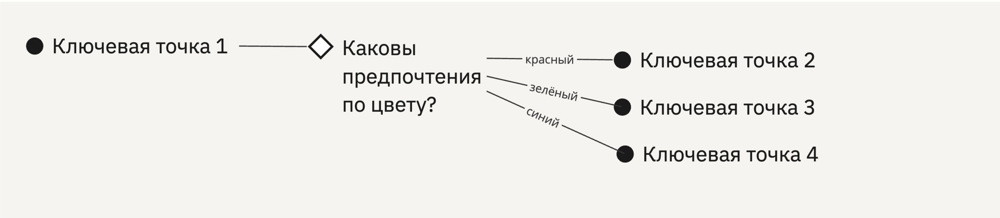

# Типичные конфигурации 

Линейный путь с опциональными точками. Вторая точка необязательна, что равносильно возможности перепрыгнуть через неё

\

Безусловное разветвление и схождение

\

Ветвление событиями

\

Ветвление триггером

\

Ветвление таблицей решений

\

Цикл

\

Петля взаимодействия, пинг-понг

\

Многовариантный старт от событий

\

Многовариантный старт через ключевые точки

\

Выравнивание события с точкой
