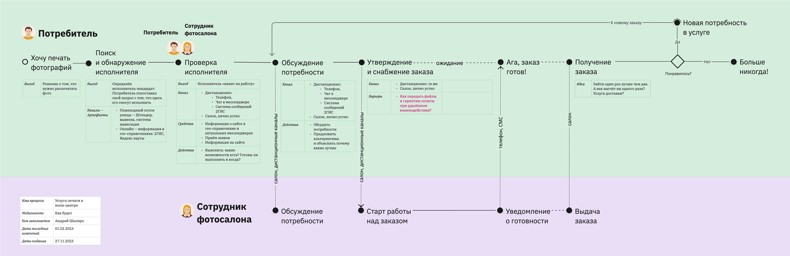

# Примеры карт процесса-опыта в ПДФ

1. [Сервис покупки рекламы на цифровых экранах](xpm-examples/01-xpm-example-advert.pdf)
2. [Услуга печати в копи-центре](xpm-examples/02-xpm-example-printout.pdf)
3. [Опыт покупки автозапчастей](xpm-examples/03-xpm-example-spareparts.pdf)
4. [Процесс составления карты процесса-опыта](xpm-examples/04-xpm-example-xpm-xpm.pdf)
5. [Обобщенная услуга](xpm-examples/05-xpm-example-common-service.pdf)
6. [Путь ассимиляции метода КПО](xpm-examples/06-xpm-example-assimilation-path.pdf)
7. [Процессы ценообразования](xpm-examples/07-xpm-example-pricing.pdf)
8. [Процесс деплоя пакетов, DevOps](xpm-examples/08-xpm-example-devops-package-deploy.pdf)